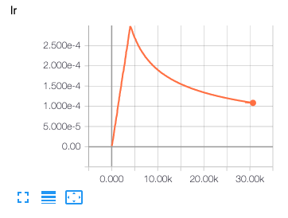
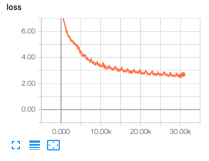

# TensorFlow 2.x Implementation of [Attention Is All You Need](https://arxiv.org/abs/1706.03762)

## Brief

    This is a Concise implementation of Transformer translator in the environment of Tensorflow 2.x. The background is I couldn't find a TF2.x implement of Transformer when I want to repeat the code of paper: Attention is All you need and do some experiments.

    After I searched in github for a while, it seems that I have to write one by my self, and this final version is based on the mixture of[example](https://www.tensorflow.org/tutorials/text/transformer?hl=zh-cn) on TF2.0 website and Kyubyong's [version](https://github.com/Kyubyong/transformer).

## Requirements

* python==3.x (Let's move on to python 3 if you still use python 2)
* tensorflow==2.x
* numpy>=1.15.4
* sentencepiece==0.1.8
* tqdm>=4.28.1

## Training

* STEP 1. Run program tfm_prepare_data.py to prepare the data

```
python3 ./tfm_prepare_data.py
```

* STEP 2. Run the program to train the model

```
python3 ./tfm_train.py
```

And if you want to adjust any hyperparameters, you could modify file tfm_hparams.py

tfm_hparams.py

* STEP 3. And after the train, there will be several checkpoints of model in the folder checkpoint/train
  * you could run command to predict and test

```
python3 ./tfm_predict.py
```

## Learning rate

Adam optimizer used and warmup strategy of 4000 steps



## Training Loss Curve



## More

* I will continue to optimize the code to make it easier to run and test
